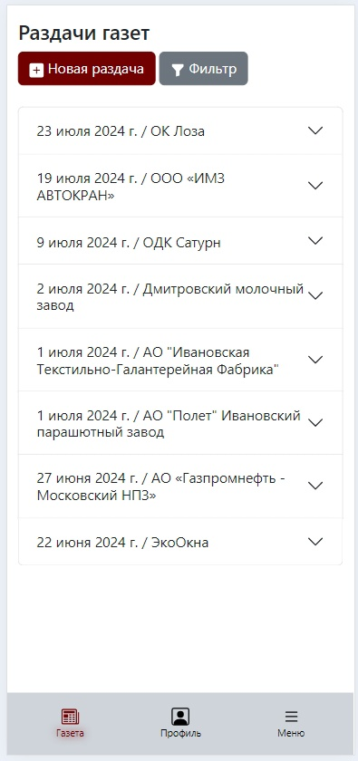
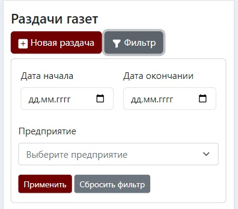
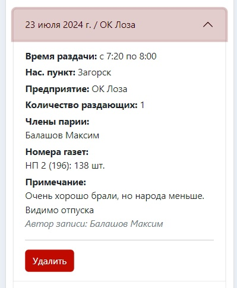

# Газета
<figure markdown="span">
{ align=center }
  <figcaption>Экран пункта меню «Газета»</figcaption>
</figure>
Пункт меню «Газета» содержит в себе сведения о раздачах партийной прессы за последние 30 дней. В верхней части экрана
находятся кнопка добавления новой раздачи и кнопка открытия фильтра раздач.

<figure markdown="span">
{ align=center }
  <figcaption>
    Вид фильтра раздач
  </figcaption>
</figure>

С помощью фильтра раздач на экран можно отфильтровать раздачи по дате и по предприятию. Дата начала и дата окончания
включаются в выборку фильтра. Все поля в фильтре необязательные. Если оставить фильтр пустым и нажать кнопку «Применить»
выведутся все раздачи, которые были загружены в систему. (Возможно, со временем, я изменю данное поведение, когда раздач
станет слишком много, и это будет отрабатывать долго). Кнопка «Сбросить фильтр» очищает все поля фильтра и приводит
список раздач к изначальному состоянию.
<figure markdown="span">
{ align=center }
  <figcaption>
    Развернутый вид записи о раздаче
  </figcaption>
</figure>

Записи о раздачах находятся в т.н. «аккордеоне». В заголовке записи указана дата и предприятие, на котором раздавались
газеты. Чтобы увидеть подробности раздачи необходимо щелкнуть по заголовку, он раскроется, покажет более подробную
информацию о раздаче. Так же, после примечания, будет указан автор записи о раздаче. У автора раздачи так же появится
кнопка «Удалить», для удаления записи. В ближайшем будущем появится возможность редактировать записи.